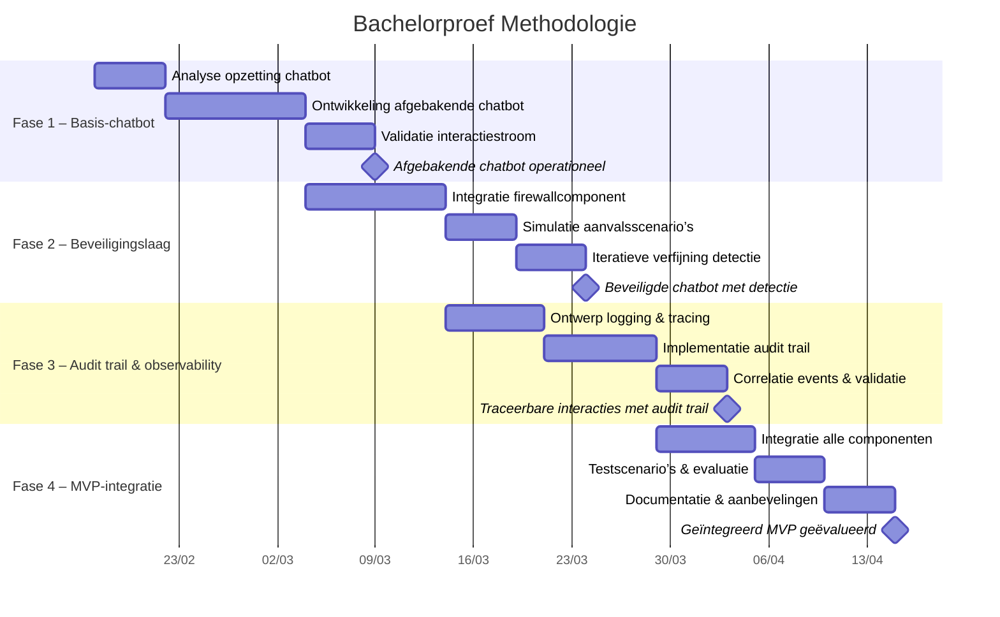

```mermaid
gantt
    title Bachelorproef Methodologie
    dateFormat  YYYY-MM-DD
    axisFormat  %d/%m

    section Fase 1 – Basis-chatbot
    Analyse opzetting chatbot        :a1, 2025-02-17, 5d
    Ontwikkeling afgebakende chatbot     :a2, after a1, 10d
    Validatie interactiestroom           :a3, after a2, 5d
    Afgebakende chatbot operationeel     :milestone, m1

    section Fase 2 – Beveiligingslaag
    Integratie firewallcomponent         :b1, after a2, 10d
    Simulatie aanvalsscenario’s          :b2, after b1, 5d
    Iteratieve verfijning detectie       :b3, after b2, 5d
    Beveiligde chatbot met detectie      :milestone, m2

    section Fase 3 – Audit trail & observability
    Ontwerp logging & tracing            :c1, after b1, 7d
    Implementatie audit trail            :c2, after c1, 8d
    Correlatie events & validatie        :c3, after c2, 5d
    Traceerbare interacties met audit trail :milestone, m3

    section Fase 4 – MVP-integratie
    Integratie alle componenten          :d1, after c2, 7d
    Testscenario’s & evaluatie           :d2, after d1, 5d
    Documentatie & aanbevelingen         :d3, after d2, 5d
    Geïntegreerd MVP geëvalueerd         :milestone, m4

```

